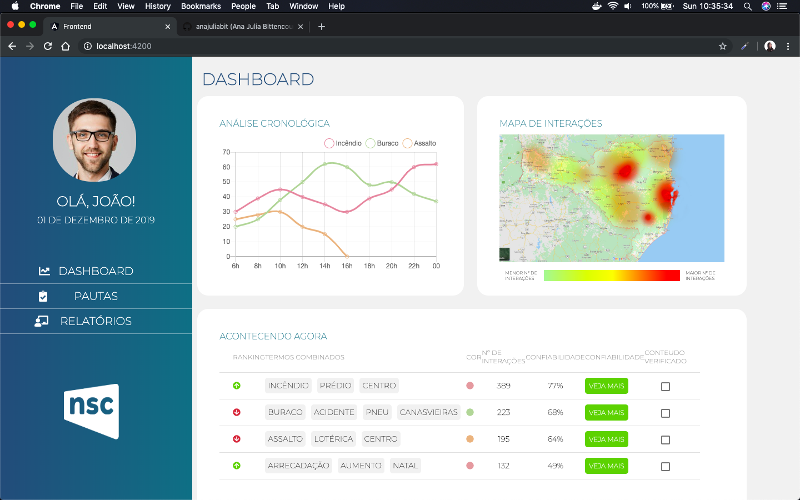

# Solução realizada no Hackathon da NSC 2019.

Este projeto foi desenvolvido durante o Hackathon da NSC 2019, cujo intuito é coletar e caracterizar as mensagens enviadas pelos leitores através do WhatsApp e disponibilizar os dados, classificados por relevância, para os repórteres através de uma interface.

## Tecnologias

Angular
Node.js
AWS Comprehend

## To do

1. Responsividade
2. Sincronização do frontend com o backend
3. Adicionar outras modais.

## Preview

;
